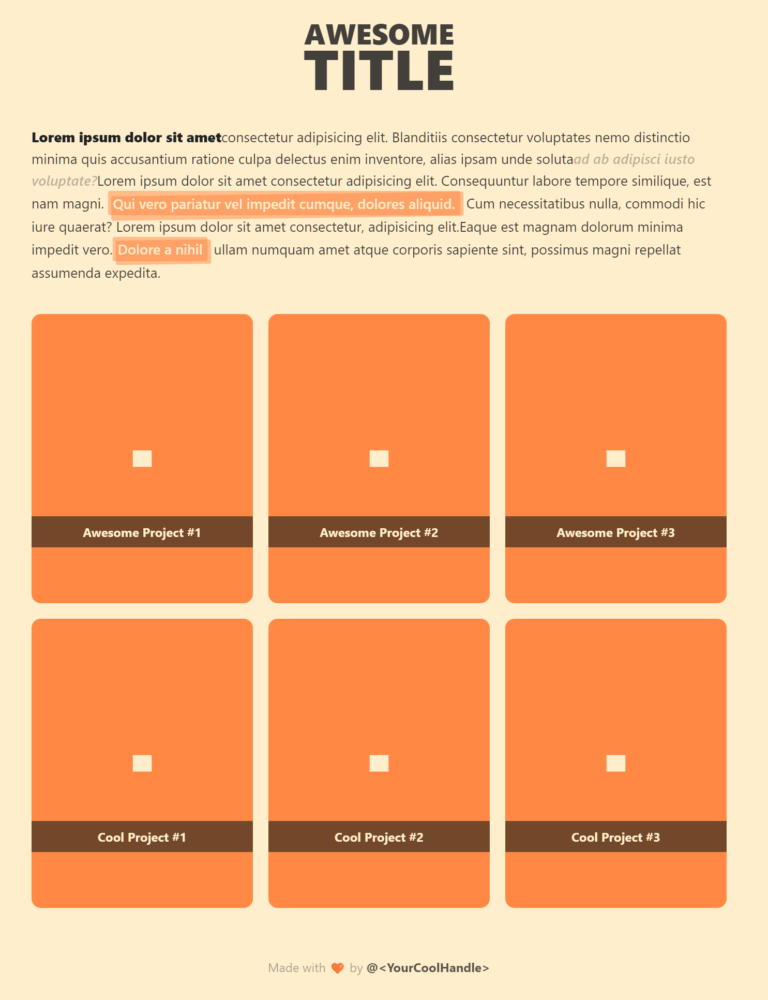

# Awesome Astro: _now with <span style="color:orange">EsLint</span>_

_<span style="color:#BBB">A template by <span style="color:#777">@DaBretema</span></span>_



## 🙋‍♂️ How to use

```bash
# Clone
git clone git@github.com:DaBretema/my-website.git --depth 1
cd my-website
rm -rf .git

# Set up your repo
git remote add origin git@github.com:<your-user>/<your-repo>.git
git add -A
git commit -m "my awesome first commit"
git push

# Install packages
pnpm install

# Happy coding!
```

## 🚀 Project Structure

Inside of your Astro project, you'll see the following folders and files:

```
/
├── .vscode/
├── public/
│   └── favicon.svg
├── src/
│   ├── components/
│   │   └── Card.astro
│   ├── layouts/
│   │   └── Layout.astro
│   └── pages/
│       └── index.astro
├── package.json
├── .editorconfig
├── .eslintignore
├── .eslintrc
├── .gitignore
├── .npmrc
├── .prettierrc.cjs
├── .astro.config.mjs
├── .tailwind.config.cjs
├── .tsconfig.json
└── README.md
```

Astro looks for `.astro` or `.md` files in the `src/pages/` directory. Each page is exposed as a route based on its file name.

There's nothing special about `src/components/`, but that's where we like to put any Astro/React/Vue/Svelte/Preact components.

Any static assets, like images, can be placed in the `public/` directory.

## 🪄 Commands

All commands are run from the root of the project, from a terminal:

| Command                   | Action                                           |
| :------------------------ | :----------------------------------------------- |
| `npm install`             | Installs dependencies                            |
| `npm run dev`             | Starts local dev server at `localhost:3000`      |
| `npm run build`           | Build your production site to `./dist/`          |
| `npm run preview`         | Preview your build locally, before deploying     |
| `npm run astro ...`       | Run CLI commands like `astro add`, `astro check` |
| `npm run astro -- --help` | Get help using the Astro CLI                     |

## 👀 Want to learn more?

Feel free to check [Astro documentation](https://docs.astro.build) or jump into their [Discord server](https://astro.build/chat).

## 📝 Pending tasks

- [ ] Add support for automatic [Uppercase HEX](https://github.com/prettier/prettier/issues/5158) colors in CSS
